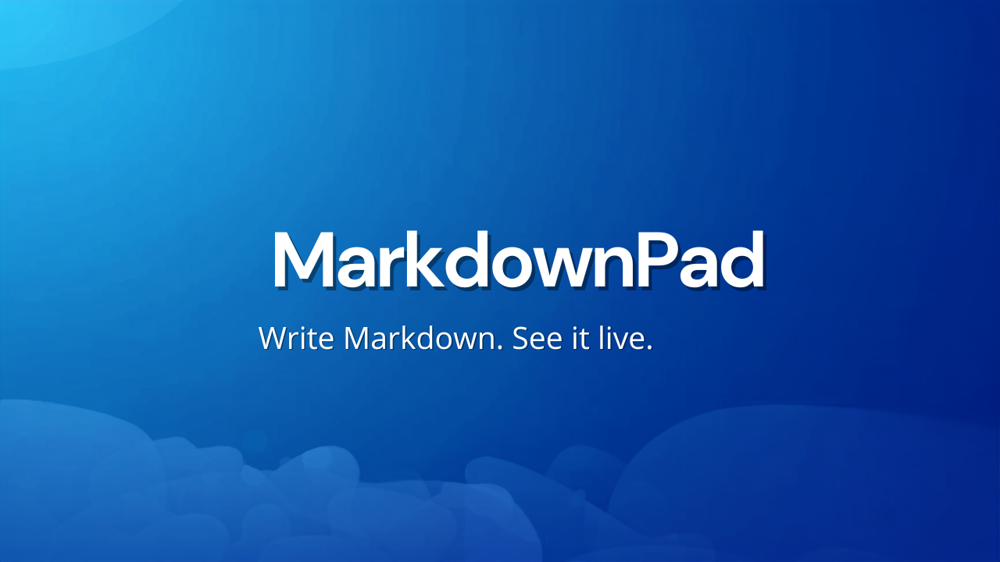
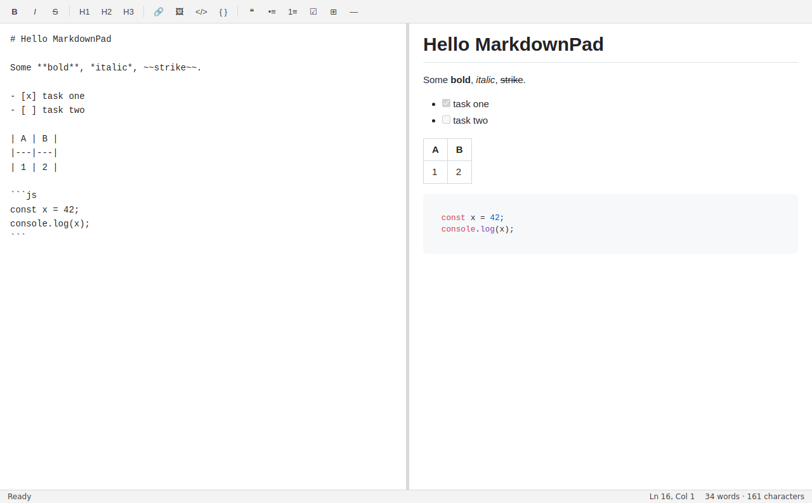

<p align="center">
  
</p>

# MarkdownPad

A Notepad-style Markdown editor for Windows 11 with a live split-pane preview and automatic saving.

<p align="center">
  
</p>

## Features

- **Split view** — write Markdown on the left, see the rendered result live on the right, with a draggable divider to resize the panes
- **Auto-save** — every keystroke is saved automatically (debounced); untitled work is kept as a draft and restored on next launch
- **Synced scrolling** — the preview follows the editor as you scroll, and vice versa
- **Formatting toolbar & shortcuts** — bold, italic, strikethrough, headings, links, images, code, quotes, lists, task lists, tables, and horizontal rules (`Ctrl+B`, `Ctrl+I`, `Ctrl+K`, `Ctrl+1/2/3`)
- **GitHub-flavored Markdown** — tables, task lists, strikethrough, and fenced code blocks with syntax highlighting
- **Export** — save your document as standalone HTML or PDF
- **File management** — Open/Save/Save As, a recent-files menu, drag-and-drop to open, and `.md`/`.markdown` file association
- **Light & dark theme** — follows your Windows theme automatically, with a manual override in the View menu
- **Status bar** — live word/character count, cursor position, and save status

## Install

Download **[MarkdownPad-Setup-1.0.0.exe](dist/MarkdownPad-Setup-1.0.0.exe)** from the `dist/` folder (or from [Releases](https://github.com/shamim316/Markdownpad/releases) once published) and run it. The installer is fully self-contained — no other dependencies needed. It creates Start Menu and desktop shortcuts and associates `.md`/`.markdown` files with MarkdownPad.

## Development

```bash
npm install
npm start          # run the app
npm run dist       # build the Windows installer (output in release/)
```

## Tech

Built with [Electron](https://www.electronjs.org/), [marked](https://marked.js.org/) (GitHub-flavored Markdown), [highlight.js](https://highlightjs.org/), [DOMPurify](https://github.com/cure53/DOMPurify), and [github-markdown-css](https://github.com/sindresorhus/github-markdown-css). Packaged as a single NSIS installer with [electron-builder](https://www.electron.build/). Icon and banner designed with [Canva](https://www.canva.com/).

## License

[MIT](LICENSE)
